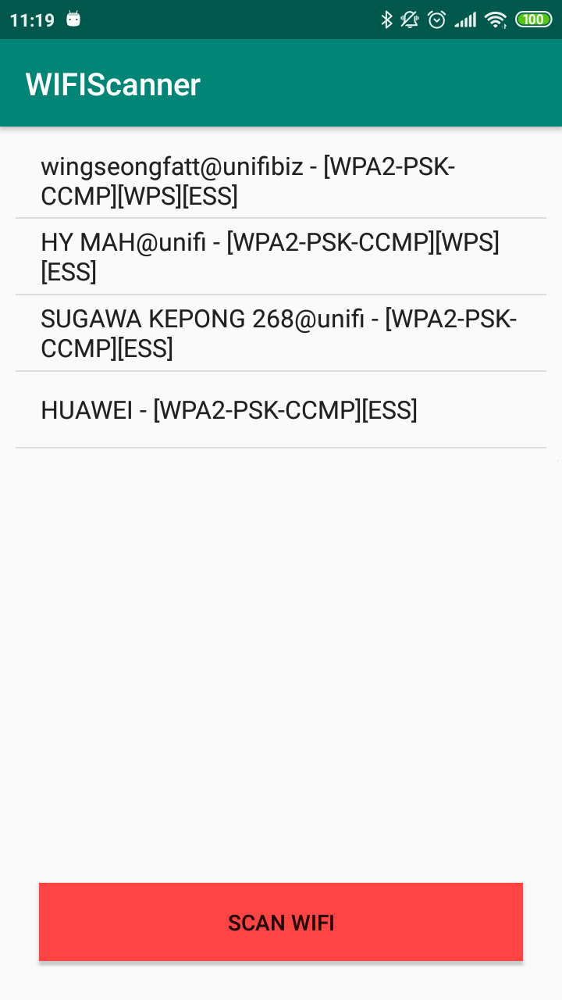

# WIFI Scanner App

  

## Getting Started

This is a mobile app that scanner nearby WIFI network.

## Deployment

Tested on Android 6.0 mobile phone.

## Built With

[Android Studio 3.3.2](https://developer.android.com/studio/) 

## Versioning

[Semantic Versioning (SemVer) 2.0.0](http://semver.org/)

## Authors
**Chong Hon Fong** - [jerrychong25](https://github.com/jerrychong25)

## License

This project is licensed under the MIT License - see the [LICENSE.md](LICENSE.md) file for details
